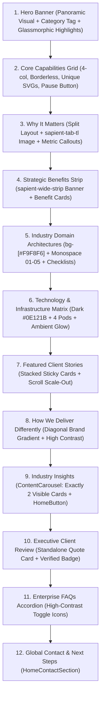

# Persici Master Codebase & Architecture Knowledge Base
## Foundations for Building the Industries & Industry Feature Pages

> **Document Purpose**:  
> This comprehensive architectural reference captures all engineering standards, design patterns, global styling conventions, component locations, typography rules, and lessons learned across the three foundational milestones:
> 1. **Milestone 1**: Codebase Analysis, Cloudflare R2 Object Storage & MongoDB Atlas Database Integration (`f1cc47e9-6664-4a63-bb20-dbb24607bbfd`)
> 2. **Milestone 2**: Floating Navbar, Micro-Interactions & Per-Zone Canvas Luminance Theme Detection (`c97cd070-9aa1-4c34-a50c-51830eaac92c`)
> 3. **Milestone 3**: Enterprise Solutions Architecture, 12-Section Sequence & Global `@shared` Component System (`720be724-acd8-494d-ac4e-40c2857cba55`)
>
> This file is the single source of truth for constructing the upcoming **Industries Hub Page** (`/[lang]/industries`) and **Individual Industry Feature Pages** (`/[lang]/industries/[slug]`).

---

## Table of Contents
1. [Core Technology Stack & Runtime Configuration](#1-core-technology-stack--runtime-configuration)
2. [Project Directory & Path Alias Structure](#2-project-directory--path-alias-structure)
3. [Global Styling & Design System (`globals.css`)](#3-global-styling--design-system-globalscss)
   - [Brand Color Palettes & Scales](#brand-color-palettes--scales)
   - [Fonts & Typography Hierarchy](#fonts--typography-hierarchy)
   - [Bilingual (EN / AR) & RTL Handling](#bilingual-en--ar--rtl-handling)
   - [Standard Layout Constants & Rhythm](#standard-layout-constants--rhythm)
4. [Master 12-Section Page Architecture](#4-master-12-section-page-architecture)
5. [Global Shared Components Catalog (`@shared`)](#5-global-shared-components-catalog-shared)
6. [Card Specifications & Hover Interaction Standards](#6-card-specifications--hover-interaction-standards)
   - [Core Capabilities / Offerings Cards](#a-core-capabilities--offerings-cards)
   - [Domain Architecture / Verticals Cards](#b-domain-architecture--verticals-cards)
   - [Technology & Infrastructure Matrix Cards](#c-technology--infrastructure-matrix-cards)
   - [Featured Client Story Cards](#d-featured-client-story-cards)
   - [Universal Content Card & Carousel](#e-universal-content-card--carousel)
7. [Vector Shapes & Diagram Rules (`SolutionsVectorDiagram`)](#7-vector-shapes--diagram-rules-solutionsvectordiagram)
8. [Data Architecture, Typing & Localized Content Patterns](#8-data-architecture-typing--localized-content-patterns)
9. [The 6 Target Industries Specifications](#9-the-6-target-industries-specifications)
10. [Database, Media Storage & Hydration Protocols](#10-database-media-storage--hydration-protocols)
11. [Golden Engineering Rules for Industries](#11-golden-engineering-rules-for-industries)

---

## 1. Core Technology Stack & Runtime Configuration

- **Framework**: Next.js 16.3.1 (App Router)
  - Async `params` protocol: In Next.js 16, page and layout route params are async Promises:
    ```tsx
    export default async function Page({ params }: PageProps<'/[lang]/industries/[slug]'>) {
      const { lang, slug } = await params;
      // ...
    }
    ```
  - Server Components by default; client components strictly flagged with `'use client'`.
- **UI Runtime**: React 19.2.8 (`react`, `react-dom`)
- **Styling**: Tailwind CSS v4 (`@tailwindcss/postcss: ^4`, `@theme inline` registration in `globals.css`)
- **Icons**: `react-icons` (specifically `Tb` for Tabler icons, `Im` for IcoMoon, `Fa` for FontAwesome), plus bespoke architectural dual-tone SVGs in `public/icons/`.
- **Database Layer**: MongoDB 7.6.0 with cached connection pooling in `lib/mongodb.ts` and graceful static fallbacks.
- **Media & Object Storage**: Cloudflare R2 (`@aws-sdk/client-s3`) with in-flight `sharp` (v0.35.3) WebP conversion (`lib/storage.ts`).
- **Internationalization**: Custom middleware `proxy.ts` using `@formatjs/intl-localematcher` and `negotiator`. Supported locales: `en` (English, LTR) and `ar` (Arabic, RTL).

---

## 2. Project Directory & Path Alias Structure

### Path Aliases (`tsconfig.json`)
```json
{
  "@/*": ["./*"],
  "@dictionaries": ["./app/[lang]/dictionaries"],
  "@dictionaries/*": ["./app/[lang]/dictionaries/*"],
  "@shared": ["./app/[lang]/(site)/_shared"],
  "@shared/*": ["./app/[lang]/(site)/_shared/*"],
  "@dashboard-shared": ["./app/[lang]/(dashboard)/_shared"],
  "@dashboard-shared/*": ["./app/[lang]/(dashboard)/_shared/*"],
  "@lib/*": ["./app/[lang]/_lib/*"]
}
```

### Route Organization (`app/[lang]/(site)/`)
```
app/[lang]/(site)/
├── _home/                         # Homepage components (hero, contact, testimonials)
├── _shared/                       # Enterprise-wide shared components, data, types, constants
│   ├── components/                # 24+ isolated modular components (each in its own folder)
│   ├── data/                      # Master datasets (e.g. featured client stories)
│   ├── constants.ts               # Spacing, containers, typography presets
│   ├── data.ts                    # Global navigation, logos, footer, CMS defaults
│   ├── types.ts                   # Universal TypeScript interfaces & MongoDB types
│   ├── utils.ts                   # cn(), getDictionary(), formatting helpers
│   └── index.ts                   # Direct barrel export for @shared
├── solutions/                     # Solutions overview & 9 feature sub-routes
│   ├── [slug]/                    # Dynamic slug dispatcher with dedicated feature folders
│   │   ├── _application-management/
│   │   ├── _digital-engineering/
│   │   ├── _ecommerce-growth/
│   │   └── ...
│   ├── _solutions/                # Main solutions hub components & services
│   └── page.tsx                   # Solutions hub entry point
├── industries/                    # Industries hub & upcoming feature sub-routes
│   ├── [slug]/                    # (To be created) Dynamic industry feature routes
│   │   ├── _consumer-products/
│   │   ├── _telecom-media-technology/
│   │   ├── _public-sector/
│   │   ├── _retail/
│   │   ├── _health/
│   │   └── _energy-commodities/
│   ├── _industries/               # (To be created) Hub components & services
│   └── page.tsx                   # Industries hub entry point
├── client-stories/                # Portfolio case studies showcase
├── how-we-do-it/                  # Delivery methodology routes
└── contact/                       # Contact & inquiry booking
```

---

## 3. Global Styling & Design System (`globals.css`)

### Brand Color Palettes & Scales
Registered via CSS variables in `:root` and exposed through Tailwind v4 `@theme inline`:

| Token | Hex Value | Role & Usage |
| :--- | :--- | :--- |
| `persici-crimson` / `primary` | `#D83427` | Primary brand accent, active states, CTA highlights, icon strokes |
| `persici-blush` / `secondary` | `#EF8C7D` | Secondary soft accent, gradient endpoints, hover states |
| `persici-black` / `dark` | `#121212` | Deep contrast black, primary headings, dark buttons |
| `persici-white` / `light` | `#FFFAFA` | Off-white background canvas, crisp contrast backgrounds |
| `persici-black-20` | `#F7F7F7` | Standard background for all Capability & Offerings cards |
| `#F9F8F6` / `#F8F7F4` | Warm Off-White | Domain Verticals / Industry Architectures section background |
| `#0E121B` | Deep Obsidian | Technology & Infrastructure Matrix dark backdrop |
| `#0B0F17` | Midnight Slate | Client Stories & Insights carousel dark backdrop |

> **Crimson & Blush Full Tiers**: Available from `10` through `90` and `100` through `950` (e.g. `bg-persici-crimson-10`, `text-persici-crimson-800`).

### Fonts & Typography Hierarchy
Defined in `app/[lang]/_lib/fonts.ts` and registered as CSS variables on `<html>`:
- **`--font-primary` (`Lexend Deca`)**: Primary heading font for Latin text (`font-primary`).
- **`--font-secondary` (`Roboto`)**: Body and UI text font for Latin text (`font-secondary`).
- **`--font-mono` (`Roboto Mono`)**: Monospace numerals, card index numbering (`01`, `02`), stats (`font-mono`).
- **`--font-cairo` (`Cairo`)**: Headings for Arabic locale (`font-cairo`).
- **`--font-tajawal` (`Tajawal`)**: Body font for Arabic locale (`font-tajawal`).

### Bilingual (EN / AR) & RTL Handling
- In Arabic (`[dir="rtl"]`, `html[lang="ar"]`), CSS rules automatically switch:
  - `h1` to `h6` automatically inherit `var(--font-cairo)`.
  - Body text automatically inherits `var(--font-tajawal)`.
- Kinetic micro-interactions mirror automatically:
  - Growing underlines originate at `bottom-left` in LTR and `bottom-right` in RTL.
  - Arrow nudges forward (`translate-x-1`) in LTR and backward (`-translate-x-1`) in RTL.
- All chevron indicators, navigation buttons, and carousel arrows flip direction when `lang === 'ar'`.

### Standard Layout Constants & Rhythm (`constants.ts`)
```tsx
export const sectionContainer = 'mx-auto max-w-8xl px-4 sm:px-6 lg:px-8';
export const sectionPaddingY = 'py-15 sm:py-20 md:py-30';
export const sectionPaddingTop = 'pt-15 sm:pt-20 md:pt-30';
export const sectionPaddingBottom = 'pb-15 sm:pb-20 md:pb-30';
```
> **Prohibition on Zero Padding**: Consecutive sections must **never** be stacked without proper vertical breathing room (`py-20 sm:py-28 lg:py-32`).

---

## 4. Master 12-Section Page Architecture

Every feature page adheres strictly to this master 12-section sequence, creating a familiar, rhythmic enterprise experience:



### Alternating Section Background Rhythm
1. **Hero**: Panoramic Image with dark/light gradient overlay.
2. **Capabilities Grid**: Crisp White (`bg-white`).
3. **Why It Matters**: Crisp White (`bg-white`).
4. **Benefits Strip**: Crisp White with wide clipped image banner.
5. **Domain Architectures**: Warm Neutral Off-White (`bg-[#F9F8F6]`).
6. **Technology Stack Matrix**: Deep Ambient Dark (`bg-[#0E121B]`).
7. **Featured Client Stories**: Deep Dark (`bg-[#0B0F17]`).
8. **How We Deliver Differently**: Brand Gradient (`from-persici-crimson via-[#E04537] to-persici-blush`).
9. **Insights Carousel**: Deep Dark (`bg-[#0B0F17]`).
10. **Client Review**: Crisp White (`bg-white`).
11. **FAQs Accordion**: Warm Neutral Off-White (`bg-[#F9F8F6]`).
12. **Global Contact**: Light / Neutral with white form card.

---

## 5. Global Shared Components Catalog (`@shared`)

All shared components reside in `app/[lang]/(site)/_shared/components/` and are re-exported via `@shared`:

```tsx
import {
  // Navigation & Core UI
  Header,
  Footer,
  Logo,
  HomeButton,
  LanguageSwitcher,
  FadeUp,
  CountUp,

  // Section Level Components
  FeaturedClientStories,
  FeaturedClientStoryCard,
  FaqSection,
  FaqItem,
  InsightsSection,
  InsightCard,
  ClientReviewSection,

  // Standalone Universal Cards
  CapabilityCard,
  IndustryCard,       // Aliased as SectorCard, VerticalCard
  TechInfrastructureCard, // Aliased as TechStackCard
  ContentCard,
  ContentCarousel,
  ShapedImageContainer,
} from '@shared';
```

### Component Details & Usage:

| Component | Location | Props & Usage Notes |
| :--- | :--- | :--- |
| **`CapabilityCard`** | `_shared/components/capability-card/` | Core capability/offering card with tag, title, description, dedicated icon, `diagramType`, bullet/pill highlights, and `isPaused`. |
| **`IndustryCard`** | `_shared/components/industry-card/` | Vertical/sector card with monospace numbering (`01`, `02`), category badge, title, narrative, checklist with `TbCircleCheck`. |
| **`TechInfrastructureCard`** | `_shared/components/tech-infrastructure-card/` | Glassmorphic card for dark `#0E121B` section. Supports `variant="pills" \| "grid"`, `headerLayout="stacked" \| "split"`, technologies array. |
| **`FeaturedClientStories`** | `_shared/components/featured-client-stories/` | 3D stacked sticky cards container with scroll scale-down effect. Accepts `stories: FeaturedClientStoryItem[]`. |
| **`FeaturedClientStoryCard`** | `_shared/components/featured-client-story-card/` | Individual sticky story card with headline, badge, `CountUp` metrics, right-aligned image, and link. |
| **`FaqSection` & `FaqItem`** | `_shared/components/faq-section/` | Accordion section and standalone items. Supports controlled or uncontrolled open/close, smooth grid-row expansion. |
| **`InsightsSection` & `InsightCard`** | `_shared/components/insights-section/` | Insights carousel section wrapping `ContentCarousel`. 2 visible cards on desktop, 1 on mobile. |
| **`ContentCarousel`** | `_shared/components/content-carousel/` | Standalone carousel supporting `visibleItems={2}`, autoplay, pauseOnHover, drag gestures, and elevation headroom padding. |
| **`ShapedImageContainer`** | `_shared/components/shaped-image-container/` | SVG `<clipPath>` masked image container (`sapient-tab-tl`, `sapient-tab-tr`, `sapient-wide-strip`). |
| **`ClientReviewSection`** | `_shared/components/client-review-section/` | Standalone executive quote quotation card with crimson border accent, monospace typography, author, role, and badge. |
| **`HomeButton`** | `_shared/components/home-button/` | Universal pill CTA button with rotating arrow circle. Handles both `<Link>` and `<button>`. |

---

## 6. Card Specifications & Hover Interaction Standards

### A. Core Capabilities / Offerings Cards
- **Background**: `bg-persici-black-20` (`#F7F7F7`).
- **Border**: Strictly `border-0` (borderless).
- **Radius**: `rounded-2xl` (16px).
- **Padding**: `p-5 sm:p-6` or `p-6 sm:p-7`.
- **Hover Action**: `hover:-translate-y-1 hover:shadow-md transition-all duration-300`. Title transitions to `group-hover:text-persici-crimson`.
- **CRITICAL Bottom Standard**: On feature pages, **NEVER add a "Learn More" or "Load More" button** at the bottom of Core Capabilities cards. The card must conclude cleanly with the descriptive narrative and highlights.
- **Iconography**: Must use bespoke dual-tone architectural SVG icons from `public/icons/`.

### B. Domain Architecture / Verticals Cards (`IndustryCard`)
- **Background**: Pure white `bg-white` on warm neutral `#F9F8F6` background.
- **Border**: `border border-slate-200/80`.
- **Hover Action**: `hover:-translate-y-1 hover:shadow-lg transition-all duration-300`.
- **Top Bar**: Monospace number (`01`, `02`) in `text-slate-400 group-hover:text-persici-crimson` with uppercase category tag.
- **Bottom**: Checklist items with crimson checkmark icons (`TbCircleCheck`).

### C. Technology & Infrastructure Matrix Cards (`TechInfrastructureCard`)
- **Background**: Dark glassmorphic `bg-white/[0.03] backdrop-blur-sm border border-white/10`.
- **Hover Action**:
  - Border lightens to `hover:border-white/25`.
  - Background elevates to `hover:bg-white/[0.05]`.
  - Card moves up slightly: `hover:-translate-y-1`.
  - Shadow glows: `hover:shadow-xl hover:shadow-black/50`.
  - **CRITICAL Title Color Rule**: **Card title MUST STAY WHITE on hover (`text-white`). It must NOT turn crimson or change color.**
- **Technology Badges**: `bg-white/[0.04] border border-white/[0.08] hover:border-white/20 text-slate-200` with crimson bullet dot (`bg-persici-crimson`).

### D. Featured Client Story Cards (`FeaturedClientStoryCard`)
- **Sticky Stacking**: `sticky top-28` with progressive stacking top offsets (`calc(5.5rem + ${idx * 1.5rem})`).
- **3D Scale-Out**: Scales down to `scale(0.95)` with subtle dimming as subsequent cards stack on top.
- **Anatomy**: Eyebrow badge capsule, bold title, descriptive summary, horizontal divider, dynamic `CountUp` metrics grid, feathered right-aligned image.

### E. Universal Content Card & Carousel (`ContentCarousel`)
- **Visible Items**: Exactly **2 visible cards on desktop and tablet**, **1 visible card on mobile** (`<640px`).
- **Elevation Headroom**: Viewport container uses negative vertical margins and positive padding (`pt-7 pb-9 -mt-6 -mb-7 px-2 -mx-2`) so cards lifting on hover (`-translate-y-2.5`) and drop shadows are never clipped by `overflow-hidden`.
- **Card Z-Index**: `hover:z-20` on active slides ensures the lifted card and its shadow layer cleanly above sibling cards.

---

## 7. Vector Shapes & Diagram Rules (`SolutionsVectorDiagram`)

Located at `app/[lang]/(site)/solutions/_solutions/components/solutions-vector-diagram.tsx`.

### Mandatory Uniqueness Rule
> **IMPORTANT**:  
> **Every single card across every page MUST have a completely UNIQUE animated vector shape diagram.**  
> Under no circumstances should two cards on the same page or across related pages use the identical vector shape.

### Synchronized Pause / Resume State
- Every animated shape element applies `style={playState}`, where:
  ```tsx
  const playState: React.CSSProperties = {
    animationPlayState: isPaused ? 'paused' : 'running',
  };
  ```
- Clicking the pause button in the bottom corner of the grid immediately freezes all animations in their exact current frame without resetting to frame 0.

### Catalog Summary (70+ Unique Shapes Available)
- Group A (Core Hub): `grid-dots`, `concentric-nodes`, `circuit-flow`, `matrix-intersect`, `nested-squares`, `orbital-radar`, `triad-mesh`, `lattice-loop`, `flow-funnel`
- Group B (Application & Management): `app-dual-stack`, `bezier-curv-engine`, `api-cluster-gateway`, `automated-test-grid`, `store-launch-trajectory`
- Group C (Ecosystem): `helix-data-strand`, `quantum-core-cube`, `cyber-shield-lock`, `neural-synapse-web`, `wave-frequency-stream`, `hexagonal-honeycomb-hive`, `prism-refraction-beam`, `compass-spatial-reticle`, `infinity-pulse-exchange`, `bar-spectrum-analyzer`
- Groups D–K (Marketing, E-Com, AI, UX, Customer Engagement, Digital Eng, Supply Chain, CRM): 45+ specialized shapes.
- New specialized industry shapes can be added directly to this catalog as needed.

---

## 8. Data Architecture, Typing & Localized Content Patterns

### Localization Rule
Every user-facing string must be provided in both English (`en`) and Arabic (`ar`).

```tsx
export interface LocalizedString {
  en: string;
  ar: string;
}
```

### Feature Data File Organization
For every feature page, all structured data lives in a dedicated data file:
`app/[lang]/(site)/industries/[slug]/_<industry-slug>/data/<industry-slug>.data.ts`

### Centralized Mock Selectors
Mock data for Client Stories must use the centralized catalog in `app/[lang]/(site)/_shared/data/featured-client-stories.data.ts`:
- Pre-built selectors: `getFeaturedStories(keys)`, `getSolutionsOverviewFeaturedClientStories()`, etc.
- When new client stories are required for industries, add them to `featured-client-stories.data.ts` and export a dedicated selector (e.g. `getRetailFeaturedClientStories()`).

---

## 9. The 6 Target Industries Specifications

The 6 industries are registered in `siteNavLinks` (`data.ts`) and dictionaries (`en.json`, `ar.json`):

| Industry Name (EN) | Industry Name (AR) | Slug & Route | Sub-directory |
| :--- | :--- | :--- | :--- |
| **Consumer Products** | المنتجات الاستهلاكية | `/industries/consumer-products` | `_consumer-products` |
| **Telecommunications, Media & Technology** | الاتصالات والإعلام والتكنولوجيا | `/industries/telecom-media-technology` | `_telecom-media-technology` |
| **Public Sector** | القطاع العام | `/industries/public-sector` | `_public-sector` |
| **Retail** | تجارة التجزئة | `/industries/retail` | `_retail` |
| **Health** | الرعاية الصحية | `/industries/health` | `_health` |
| **Energy & Commodities** | الطاقة والسلع | `/industries/energy-commodities` | `_energy-commodities` |

### Expected Architecture for Industries
1. **Industries Hub Page** (`app/[lang]/(site)/industries/page.tsx`):
   - Replaces the current temporary `<ServicesView>` placeholder.
   - Houses `IndustriesView` with a hero, 6-industry offerings grid (with pause button and unique vector shapes), why it matters, benefits strip, client stories, delivery engine, insights, client review, FAQs, and contact section.
2. **Dynamic Industry Route** (`app/[lang]/(site)/industries/[slug]/page.tsx`):
   - Generates static params for `locales` x `6 industries`.
   - Creates localized metadata via `createMetadata()`.
   - Dispatches to dedicated industry view components (`ConsumerProductsView`, `RetailView`, etc.) with generic fallback.

---

## 10. Database, Media Storage & Hydration Protocols

### MongoDB Atlas Readiness (`lib/mongodb.ts` & `_shared/services/db.service.ts`)
- Server-side data fetching uses `getPageContent(slug, fallbackData)`.
- If `MONGODB_URI` is not set or the collection is empty, it safely returns the in-code fallback dataset with zero runtime crashes.

### Cloudflare R2 Object Storage (`lib/storage.ts`)
- Connected to bucket `persici-media`.
- CDN URL: `https://pub-e908bcd9e763481eb2c8ac2e24869f18.r2.dev/`.
- In-flight Sharp pipeline converts uploaded images to optimized `.webp` (quality: 80).
- Unsplash imagery is fully supported for high-resolution development mocks.

### Hydration Mismatch Defense (`bis_skin_checked="1"`)
- Browser security extensions (like Bitdefender TrafficLight) inject `bis_skin_checked="1"` into DOM elements before React hydrates.
- A pre-hydration interceptor script is active in `app/[lang]/layout.tsx` to scrub injected attributes.
- Always include `suppressHydrationWarning` on interactive wrappers and root elements.

---

## 11. Golden Engineering Rules for Industries

1. **Strict 1:1 Parity with Solutions**: The visual density, spacing rhythm, font families, and animation polish of the Industries pages must match the Solutions pages.
2. **Use `@shared` First**: Always import existing shared components (`CapabilityCard`, `IndustryCard`, `TechInfrastructureCard`, `FeaturedClientStories`, `FaqSection`, `InsightsSection`, `ClientReviewSection`, `HomeButton`) from `@shared`. Do not duplicate them inside feature folders.
3. **No 'Learn More' Button on Capability Cards**: Core Capabilities cards on feature pages must terminate cleanly without a button.
4. **Dark Section Hover Rule**: In dark `#0E121B` sections, the title must remain `text-white` on hover; only the border and background elevate.
5. **Unique Animated Vector Shapes**: Every card must feature a distinct, unique animated SVG shape with synchronized pause/resume support.
6. **2-Card Desktop Carousel Rule**: The `ContentCarousel` in Insights must display strictly 2 cards on desktop/tablet and 1 card on mobile.
7. **Complete Bilingual Translation**: Every heading, subtitle, bullet point, FAQ, and metric label must provide both `en` and `ar`.
8. **Verify Before Completion**: Always run `npm run lint` and verify zero compilation errors.
