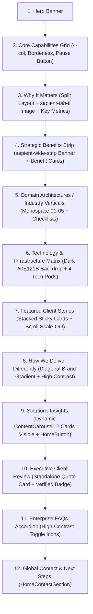

# Persici Solutions & Solutions Features Pages: Master Design & Engineering Reference

> **Document Purpose**:  
> This document is the single source of truth and definitive technical specification for creating, enhancing, and maintaining the main **Solutions Page** (`/[lang]/solutions`) and all individual **Solution Feature Pages** (`/[lang]/solutions/[slug]`) across the Persici Agency platform.  
> 
> Any developer or agent working on new solution pages (e.g., *Digital Engineering*, *Customer Engagement*, *AI Integration*, *Cloud & Infrastructure*, *Supply Chain*, *E-Commerce Growth*, etc.) **MUST review and strictly adhere to the rules, structure, and methodologies defined herein** before writing code.

---

## Table of Contents
1. [Core Architectural Philosophy & Parity Rules](#1-core-architectural-philosophy--parity-rules)
2. [Master 12-Section Page Structure & Sequence](#2-master-12-section-page-structure--sequence)
3. [Section-by-Section Engineering Specifications](#3-section-by-section-engineering-specifications)
   - [Section 1: Hero Banner](#section-1-hero-banner)
   - [Section 2: Core Capabilities / Offerings Grid](#section-2-core-capabilities--offerings-grid)
   - [Section 3: Why It Matters](#section-3-why-it-matters)
   - [Section 4: Strategic Benefits Strip](#section-4-strategic-benefits-strip)
   - [Section 5: Domain Architectures / Industry Verticals](#section-5-domain-architectures--industry-verticals)
   - [Section 6: Technology & Infrastructure Matrix](#section-6-technology--infrastructure-matrix)
   - [Section 7: Featured Client Stories (Stacked Sticky Cards)](#section-7-featured-client-stories-stacked-sticky-cards)
   - [Section 8: How We Deliver Differently](#section-8-how-we-deliver-differently)
   - [Section 9: Solutions Insights (Dynamic 2-Card Carousel)](#section-9-solutions-insights-dynamic-2-card-carousel)
   - [Section 10: Executive Client Review](#section-10-executive-client-review)
   - [Section 11: Enterprise FAQs Accordion](#section-11-enterprise-faqs-accordion)
   - [Section 12: Global Contact & Next Steps](#section-12-global-contact--next-steps)
4. [Offerings Cards Design, Interaction & Styling Standards](#4-offerings-cards-design-interaction--styling-standards)
5. [Animated Vector Shapes (`SolutionsVectorDiagram`) Master Rules](#5-animated-vector-shapes-solutionsvectordiagram-master-rules)
   - [Mandatory Uniqueness Rule](#mandatory-uniqueness-rule)
   - [24-Shape Complete Catalog & Assignments](#24-shape-complete-catalog--assignments)
   - [Animation Pause & Resume Synchronization](#animation-pause--resume-synchronization)
6. [Standalone Universal Content Carousel (`ContentCarousel`)](#6-standalone-universal-content-carousel-contentcarousel)
7. [Universal Multi-System Content Card (`ContentCard`)](#7-universal-multi-system-content-card-contentcard)
8. [Shaped Image Containers (`ShapedImageContainer`) Standards](#8-shaped-image-containers-shapedimagecontainer-standards)
9. [Spacing, Rhythm & Vertical Cadence Standards](#9-spacing-rhythm--vertical-cadence-standards)
10. [Bilingual (EN / AR), RTL & Mock Data Protocols](#10-bilingual-en--ar-rtl--mock-data-protocols)

---

## 1. Core Architectural Philosophy & Parity Rules

1. **1:1 Structural & Visual Parity**:
   - The main Solutions page and every individual Solution Feature page share the same design language, component structure, animation standards, and responsive hierarchy.
   - When a user transitions from `/solutions` to `/solutions/application-management` or any other feature page, the experience feels unified, enterprise-grade, and familiar.
2. **Primary References**:
   - **Publicis Sapient Visual Aesthetic**: Clean, borderless cards, sophisticated vector diagrams, high-contrast typography, and dynamic sticky stacked client stories.
   - **Main Solutions Page**: The foundational reference for all shared layout components, spacing scales, and color systems.
   - **Old Persici Website**: Content and domain knowledge source (e.g., `https://persiciagency.com/application-management/`). Extract authentic capabilities, tech stacks, and industry narratives.
3. **Strict Separation of Concerns**:
   - Content and localized strings live in a dedicated data file: `app/[lang]/(site)/solutions/[slug]/_<feature-name>/data/<feature-name>.data.ts`.
   - Components live in `app/[lang]/(site)/solutions/[slug]/_<feature-name>/components/`.
   - Shared cross-cutting components live in `app/[lang]/(site)/_shared/components/`.

---

## 2. Master 12-Section Page Structure & Sequence

Every Solution Feature page must adhere to this exact sequence of sections:



---

## 3. Section-by-Section Engineering Specifications

### Section 1: Hero Banner
- **Component**: Reuses or mirrors `<SolutionsHeroSection />`.
- **Elements**:
  - Eyebrow pill badge (e.g., "Solutions & Engineering" / "الحلول والهندسة").
  - Secondary category tag (e.g., "Application & Management" / "التطبيقات والإدارة").
  - High-impact H1 title and localized narrative subtitle.
  - Primary CTA button (`HomeButton`) linking to `#contact` or strategy scheduling.
  - Panoramic hero image with gradient overlay.
  - 4 high-value key capability highlights displayed in a sleek glassmorphic pill bar.

### Section 2: Core Capabilities / Offerings Grid
- **Component**: `<ApplicationOfferingsGrid />` (or equivalent feature grid).
- **Layout**: 4 cards per row on large desktop (`xl:w-[calc(25%-18px)]`), 3 on laptop, 2 on tablet, 1 on mobile. Incomplete rows must be **centered** (`flex flex-wrap justify-center`).
- **Cards**:
  - Background: Brand gray `bg-persici-black-20` (`#F7F7F7`).
  - Borders: `border-0` (strictly borderless).
  - Hover: `hover:-translate-y-1 hover:shadow-md transition-all duration-300`.
  - Content: Tag, Title, Description, Bullet Highlights, and a "Learn more" link.
  - Icon: Dedicated high-resolution SVG icon from `public/icons/solutions/`.
  - Animated Vector Shape: **A unique animated shape per card** (see [Section 5](#5-animated-vector-shapes-solutionsvectordiagram-master-rules)).
- **Controls**:
  - Sleek icon-only pause/resume button located at the bottom-right corner of the grid (`justify-end`).
  - Freezes all card vector animations simultaneously when toggled.

### Section 3: Why It Matters
- **Component**: Reuses `<SolutionsWhyItMatters />`.
- **Layout**: Two-column split layout (Visual on one side, Narrative on the opposite).
- **Visual**: Uses `<ShapedImageContainer shape="sapient-tab-tl" />` (top-left tab, stepped shoulder, inward notch).
- **Narrative**:
  - Section title & localized strategic description.
  - 2 high-impact metric callout stats with large numerals and descriptive labels.

### Section 4: Strategic Benefits Strip
- **Component**: Reuses `<SolutionsBenefitsStrip />`.
- **Visual**: Panoramic wide banner clipped with `<ShapedImageContainer shape="sapient-wide-strip" />`.
- **Cards**: 4 distinct strategic benefit cards highlighting ROI, velocity, risk mitigation, and retention.

### Section 5: Domain Architectures / Industry Verticals
- **Component**: `<ApplicationVerticalsSection />` (or equivalent).
- **Background**: Subtle warm neutral `bg-[#F9F8F6]` to provide rhythm between the white benefits section above and the dark tech stack below.
- **Cards**:
  - Monospace numeral indicators (`01`, `02`, `03`, etc.).
  - Category pill badge.
  - Title and descriptive narrative.
  - Checklist of core domain capabilities.

### Section 6: Technology & Infrastructure Matrix
- **Component**: `<ApplicationTechStackSection />` (or equivalent).
- **Background**: Deep ambient dark `bg-[#0E121B]` with soft red ambient glow blur.
- **Layout**: 4-pod matrix (e.g., Mobile Frameworks, Backend & Cloud APIs, Databases & Caching, DevOps & CI/CD).
- **Pods**: Dark glass cards (`bg-white/[0.03] border border-white/10`) with technology badge pills (`bg-white/5 border border-white/10 text-white`).

### Section 7: Featured Client Stories (Stacked Sticky Cards)
- **Component**: Reuses `<StackedFeaturedClientStories />` (`app/[lang]/(site)/solutions/_solutions/components/stacked-featured-client-stories.tsx`).
- **Centralized Shared Mock Repository**:
  - All mock client story data lives in `app/[lang]/(site)/_shared/data/featured-client-stories.data.ts` and is re-exported via `@shared/data`.
  - **Do NOT create separate or conflicting inline mock data objects** on each feature page.
  - Curated selectors provided:
    - `getMarketingFeaturedClientStories()`: Lahfaa Perfumes, Meraas The Beach, Meraas La Mer, Hala Food.
    - `getApplicationManagementFeaturedClientStories()`: Hala Food App, FinVibe Trading.
    - `getSolutionsOverviewFeaturedClientStories()`: Nissan Mobility, Lahfaa Perfumes, Hala Food.
    - `getFeaturedStories(keys)`: Custom selection from master catalog.
- **Card Content & Anatomy Requirements**:
  - **Eyebrow Badge Capsule**: Rendered above the title (`story.badge` / `story.category` / `story.subtitle`). Identifies the industry, service vertical, or specialization.
  - **Main Story Headline**: Bold, high-impact title (`story.title`).
  - **Narrative Description**: Detailed project context and strategic impact (`story.description` / `story.summary`). Must never be omitted.
  - **Metrics Divider & Grid**: Clean horizontal divider line above a dynamic 1-4 column CountUp metrics grid with localized numeric values and labels.
  - **Mockup Visual**: High-resolution image positioned on the right half with seamless gradient blend fading into the white card background.
- **Sticky Mechanism & Scale Animation**:
  - Uses CSS `sticky top-28` with progressive stacking offsets (`top-[calc(5.5rem+${index*1.5rem})]`).
  - Cards scale down smoothly (`scale: 1 - progress * 0.05` down to `scale(0.95)` and gentle dimming) as subsequent cards scroll over them, giving tactile physical depth.

### Section 8: How We Deliver Differently
- **Component**: Reuses `<SolutionsDeliveryEngine />`.
- **Background**: Rich diagonal brand gradient from Persici Crimson to Persici Blush (`bg-gradient-to-br from-persici-crimson via-[#E04537] to-persici-blush`).
- **Typography & Contrast**:
  - Eyebrow badge: Frosted white pill (`text-white bg-white/15 border border-white/20`).
  - Title: Pure crisp `text-white`.
  - Subtitle: High-legibility `text-white/90`.
  - Pillar numbers: Solid circular white badges with crimson numbers (`bg-white text-persici-crimson font-extrabold`).
  - Pillar descriptions: Pure white and `text-white/90` with frosted dividers (`divide-white/20`).
  - Shaped image container: `<ShapedImageContainer shape="sapient-tab-tr" />` with soft drop shadow, no rigid border.

### Section 9: Solutions Insights (Dynamic 2-Card Carousel)
- **Component**: `<SolutionsInsightsSection />`.
- **Position**: Placed strictly **under** "How We Deliver Differently" and **above** "Client Review".
- **Background**: Dark background matching Client Stories (`bg-[#0B0F17]`).
- **Carousel Configuration**:
  - Uses the universal `<ContentCarousel />`.
  - Visible cards: Exactly **2 visible cards on desktop** / tablet, **1 visible card on mobile**.
  - Dynamic attributes: `speed={450}`, `autoplay={true}`, `pauseOnHover={true}`, `orderBy="default"`.
  - Action button: Styled using `HomeButton` ("Explore All Insights" / "استكشف كافة الرؤى والأفكار").

### Section 10: Executive Client Review
- **Component**: Reuses `<SolutionsClientReview />`.
- **Content**: Standalone verified client testimonial quote, executive author name, corporate title, and verified enterprise badge.

### Section 11: Enterprise FAQs Accordion
- **Component**: Reuses `<SolutionsFaqSection />`.
- **Items**: 6 comprehensive, localized Q&A accordions covering frameworks, timelines, store approvals, legacy integrations, SLAs, and security compliance.
- **Interaction**: Crisp plus/minus or chevron toggle icon with sharp contrast in both open and closed states.

### Section 12: Global Contact & Next Steps
- **Component**: `<HomeContactSection />`.
- **Content**: Integrated contact form and consultation booking.

---

## 4. Offerings Cards Design, Interaction & Styling Standards

All offerings and core capability cards must follow these strict rules:

### Visual Properties
- **Background**: `bg-persici-black-20` (`#F7F7F7`).
- **Borders**: `border-0` (never apply borders to offerings cards).
- **Border Radius**: `rounded-2xl` (16px) or `rounded-3xl` (24px).
- **Padding**: `p-6 sm:p-7` for a compact, well-proportioned density.
- **Divider Line**: Inner separator must use `border-persici-black/5`.

### Hover Interactions & Card Bottom Standard
- **Card Lift**: `hover:-translate-y-1 hover:shadow-md transition-all duration-300`.
- **NO 'Learn More' or 'Load More' Button in Core Capabilities**:
  - > **MANDATORY RULE**: In **Core Capabilities** cards across all Solution Feature pages, **DO NOT add a 'Learn More' or 'Load More' button/link**.
  - The cards must end cleanly at the bottom with the descriptive narrative and the highlight pills / bullet tags (separated by a subtle `border-persici-black/5` divider).
  - (Note: The main Solutions overview page (`/solutions`) retains its "Explore Solution" navigational link that leads directly to the sub-feature pages).

### Capability Card Iconography Standard
- **Dual-Tone Architectural SVG System**:
  - Every Core Capability card must feature a modern bespoke `48x48` dual-tone SVG icon matching the high-end style established in **Application & Management**.
  - **Color Tokens**:
    - Primary Structural Stroke: `#D83427` (Persici Crimson) with `stroke-width="2.5"`.
    - Contrast Elements & Accents: `#121212` (Persici Black) with `stroke-width="2"` or `2.5`.
    - Soft Tinted Fill: `#FFF5F4` (Crimson 5% soft blush backdrop).
    - Highlights: `#FFFFFF` and `#EF8C7D` (Persici Blush).
  - **Prohibition**: Never use plain monochrome wireframe icons (`stroke="currentColor"` with no fills). All capability icons must share the brand's dual-tone architectural aesthetic.

---

## 5. Animated Vector Shapes (`SolutionsVectorDiagram`) Master Rules

### Mandatory Uniqueness Rule
> **IMPORTANT**:
> **Every single card across every page MUST have a completely UNIQUE animated vector shape diagram.**  
> Under no circumstances should two cards on the same page or across related solution pages use the exact same vector diagram. When building a new solution feature page, select or author a new unique shape diagram tailored to that feature.

### Technical Specifications
- **Format**: Pure inline SVG with embedded `<style>` keyframe animations.
- **ViewBox**: `viewBox="0 0 80 80"`.
- **Color Palette**:
  - Active Accents / Nodes / Beams: Persici Crimson (`#D83427` / `fill-persici-crimson` / `stroke-persici-crimson`).
  - Main Traces / Rings / Frameworks: Light Slate (`#CBD5E1`) and Slate (`#94A3B8`).
  - Coordinate & Datum Lines: Faint Slate (`#E2E8F0`).
- **Animation Performance**: CSS GPU-accelerated transforms (`rotate`, `translate`, `scale`, `stroke-dashoffset`). Zero JavaScript animation loops.

### Animation Pause & Resume Synchronization
- Every animated SVG element **MUST** apply `style={playState}`, where:
  ```tsx
  const playState: React.CSSProperties = {
    animationPlayState: isPaused ? 'paused' : 'running',
  };
  ```
- This ensures that when the user clicks the pause button in the bottom corner of the grid, all animations immediately freeze in place, and resume seamlessly without resetting to frame 0.

---

### 24-Shape Complete Catalog & Assignments

The library in `solutions-vector-diagram.tsx` contains 34 distinct shapes:

#### Group A: Core Solutions Page Shapes (9 Shapes)
1. `grid-dots`: 4x4 matrix of dots with pulsing crimson nodes.
2. `concentric-nodes`: Concentric counter-rotating rings with center crosshairs.
3. `circuit-flow`: Stepped printed circuit board traces with flowing dashed electrons.
4. `matrix-intersect`: 3 interconnected rotating orbital nodes with connecting curved bridges.
5. `nested-squares`: Outer static square with counter-rotating inner square and diagonal corner braces.
6. `orbital-radar`: Concentric range rings with a fast 360° rotating radar sweep arm.
7. `triad-mesh`: Delta triangle frame with internal centroid lines and pulsing vertices.
8. `lattice-loop`: Continuous figure loop with animated dash flow and balanced dual nodes.
9. `flow-funnel`: Converging horizontal tiers with dashed flow line down to a crimson focal point.

#### Group B: Application & Management Specialized Shapes (5 Shapes)
10. `app-dual-stack`: Layered smartphone and tablet device frames with cross-platform animated data sync bridge, UI screen skeleton lines, and pulsing touch interaction ping (*Assigned to: iOS & Android App Development*).
11. `bezier-curv-engine`: Precision vector design engine with square anchor points, tangent control handles, rotating pen crosshairs, and a flowing cubic Bézier spline (*Assigned to: UI/UX Design for Mobile*).
12. `api-cluster-gateway`: Concentric central API gateway router hub surrounded by 4 distributed microservice satellite nodes with high-throughput dashed packet transmission lines (*Assigned to: Backend & API Development*).
13. `automated-test-grid`: 3x3 test harness matrix with passing test checkmarks, verified status badges, and an active vertical laser sweep scan beam (`anim-scan-v`) (*Assigned to: Quality Assurance & Testing*).
14. `store-launch-trajectory`: Ground launch platform with an upward sweeping ballistic trajectory arc reaching an orbital App Store / Google Play target with rotating beacon radar pings (*Assigned to: App Deployment & Launch Support*).

#### Group C: Extended Solution & Ecosystem Shapes (10 Shapes)
15. `helix-data-strand`: Double-helix intertwining sinusoidal data waves with pulsing codon rungs (*For Data & AI*).
16. `quantum-core-cube`: 3D isometric wireframe cube rotating around a pulsing quantum singularity core (*For Cloud Infrastructure*).
17. `cyber-shield-lock`: Protective security shield with counter-rotating biometric rings and cryptographic lock (*For Cybersecurity & Governance*).
18. `neural-synapse-web`: 3-layer neural network with firing synaptic weight paths and glowing activation nodes (*For AI & Deep Learning*).
19. `wave-frequency-stream`: Oscilloscope grid with live high-frequency waveform, echo trace, and peak hold marker (*For Real-Time Streaming*).
20. `hexagonal-honeycomb-hive`: Tesselated modular honeycomb cluster with active center core (*For Architecture & Scalability*).
21. `prism-refraction-beam`: Optical triangular prism splitting an incident strategic beam into 3 refracted radiant beams (*For Marketing & Strategy*).
22. `compass-spatial-reticle`: Spatial precision reticle with cardinal tick marks and a rotating directional scanner needle (*For Experience Transformation*).
23. `infinity-pulse-exchange`: Continuous figure-8 lemniscate circuit with circulating value exchange tokens (*For Supply Chain & Logistics*).
24. `bar-spectrum-analyzer`: Dynamic metric equalizer bars with bouncing heights and an exponential growth trend curve (*For E-Commerce Growth & Analytics*).

#### Group D: Marketing & Communications Specialized Shapes (4 Shapes)
25. `creative-story-lens`: High-precision optical camera lens aperture with rotating blades, alignment reticles, and central focal node (*Assigned to: Content & Creative Storytelling*).
26. `omnichannel-radial-mesh`: Hexagonal omnichannel synchronization framework with bi-directional transmission bus and 6 touchpoint satellites (*Assigned to: Integrated Omnichannel Campaigns*).
27. `social-resonance-echo`: Concentric broadcast resonance waves with community pulse nodes and engagement connection lines (*Assigned to: Social Media & Community Engagement*).
28. `media-production-timeline`: Film strip with sprockets, audio waveform trace, moving scrubber playhead, and live studio recording beacon (*Assigned to: Media & Content Production*).

#### Group E: E-Commerce Growth Specialized Shapes (6 Shapes)
29. `growth-trajectory-engine`: Compounding exponential GMV trajectory curve with milestone growth markers and radar ping beacon (*Assigned to: Digital Commerce Strategy*).
30. `storefront-render-matrix`: High-speed headless catalog grid with product cards assembling and sub-second laser scan beam (*Assigned to: Store Design & Development*).
31. `ad-targeting-matrix`: Concentric precision audience targeting reticles with cardinal guides and rotating acquisition sweep (*Assigned to: Performance Marketing*).
32. `cart-checkout-funnel`: Shopping cart with moving items into cart, instant conversion flow line, and sub-second checkout pulse beacon (*Assigned to: Conversion Rate Optimization*).
33. `omnichannel-inventory-sync`: Central commerce hub with 4-way inventory sync spokes to web, POS, marketplaces, and warehouse ERP (*Assigned to: Omnichannel & Marketplace Strategy*).
34. `retention-loop-orbit`: Continuous customer lifecycle retention oval orbit with revolving VIP loyalty diamond nodes (*Assigned to: Retention, Lifecycle Data & Growth*).

---

## 6. Standalone Universal Content Carousel (`ContentCarousel`)

- **Component Location**: `app/[lang]/(site)/_shared/components/content-carousel/content-carousel.tsx`.
- **Export**: Exported via `@shared` and `@shared/components/content-carousel`.
- **Card Compatibility**: Renders the universal `<ContentCard />` component for each slide.
- **Desktop/Mobile Responsive Standard**:
  - **Desktop / Tablet**: Exactly **2 visible cards** at all times (`visibleItems={2}`).
  - **Mobile (<640px)**: Exactly **1 visible card** at all times (`visibleItems={1}`).
- **Configurable Props**:
  - `speed`: Transition duration in milliseconds (default `450`).
  - `orderBy`: `'default' | 'random' | 'name' | 'category' | 'date'`.
    - `'random'` executes a Fisher-Yates shuffle on initialization.
    - `'name'` / `'title'` sorts alphabetically by localized title.
    - `'date'` sorts by timestamp descending.
  - `category`: String filter to isolate specific category/taxonomy items.
  - `autoplay`: Boolean to enable auto-advance.
  - `autoplayInterval`: Interval in milliseconds (default `5000`).
  - `pauseOnHover`: Boolean to pause autoplay when mouse hovers over the track.
  - `loop`: Boolean for infinite circular wrapping.
- **Navigation Controls**:
  - Circular next / previous buttons with brand hover transitions and automatic RTL flipping.
  - Active pill pagination indicators/dots (`w-6` active pill vs `w-2` inactive dots).
  - Mobile touch swipe / drag gesture support.
- **Hover Elevation & Shadow Headroom**:
  - The outer viewport uses `pt-7 pb-9 -mt-6 -mb-7 px-2 -mx-2` so that when cards lift on hover (`hover:-translate-y-2.5`) and project multi-layered shadows (`hover:shadow-[0_22px_45px_-12px_rgba(0,0,0,0.14),0_8px_18px_-6px_rgba(216,52,39,0.08)]`), neither the card body nor its shadow is clipped by `overflow-hidden`.
  - Individual slides elevate with `relative hover:z-20` so the active card's elevation and shadow layer seamlessly on top of adjacent slides.

---

## 7. Universal Multi-System Content Card (`ContentCard`)

- **Component Location**: `app/[lang]/(site)/_shared/components/content-card/content-card.tsx`.
- **Core Capability**: Engineered as a **universal multi-system card** capable of digesting data from:
  1. **Insights System**: Research articles, whitepapers, thought leadership.
  2. **Blog System**: Industry updates, tutorials, engineering posts.
  3. **Client Stories & Portfolio**: Case studies, project spotlights, delivered client results.
- **Data Contract (`ContentCardItem`)**:
  ```typescript
  export interface ContentCardItem {
    id: string;
    slug: string;
    title: { en: string; ar: string } | string;
    category: { en: string; ar: string } | string;
    date: string;
    excerpt?: { en: string; ar: string } | string;
    image?: string;
    href?: string;
    author?: string;
    readTime?: string;
    systemType?: 'insight' | 'blog' | 'case-study' | 'portfolio';
  }
  ```

---

## 8. Shaped Image Containers (`ShapedImageContainer`) Standards

- **Component Location**: `app/[lang]/(site)/_shared/components/shaped-image-container/shaped-image-container.tsx`.
- **Technology**: Dynamic SVG `<clipPath clipPathUnits="objectBoundingBox">`. Never use pre-cropped image assets.
- **Geometric Shapes**:
  1. `sapient-tab-tl`: Top-left high tab, rounded stepped shoulder, bottom-left inward notch. Used in **Why It Matters** and **Solution Detail Hero**.
  2. `sapient-tab-tr`: Mirrored variant (top-right high tab, bottom-right stepped shoulder). Used in **How We Deliver Differently**.
  3. `sapient-wide-strip`: Wide panoramic banner framing with notched corners. Used in **Benefits Strip**.
  4. `sapient-stepped-diagonal`: Opposite stair-stepped corners. Used in **Story Spotlight**.
  5. `sapient-notched-bl`: Subtle single-corner notch.

---

## 9. Spacing, Rhythm & Vertical Cadence Standards

> **CAUTION**:
> **Zero-Padding Violations Are Prohibited**:  
> Never place sections immediately after one another without proper vertical padding. Tight, cramped sections degrade the enterprise aesthetic.

### Vertical Padding Rules
- **Standard Light / Neutral Sections**: `py-20 sm:py-28 lg:py-32` (80px–128px padding top and bottom).
- **Immersive Dark Sections** (e.g., Tech Stack, Sticky Client Stories): `py-20 sm:py-28 lg:py-36` (80px–144px padding top and bottom).
- **Header-to-Grid Margins**: `mb-14 sm:mb-20` (56px–80px margin bottom from headers to card grids).

### Alternating Section Background Cadence
To ensure visual separation between consecutive sections, maintain this alternating cadence:
1. Section 1 (Hero): Panoramic Image / Ambient Gradient.
2. Section 2 (Core Capabilities): Crisp Clean White (`bg-white`).
3. Section 3 (Why It Matters): Light / White (`bg-white`).
4. Section 4 (Benefits Strip): White with Wide Clipped Image Strip.
5. Section 5 (Domain Architectures): Warm Neutral Tint (`bg-[#F9F8F6]`).
6. Section 6 (Tech Stack): Deep Ambient Dark (`bg-[#0E121B]`).
7. Section 7 (Client Stories): Deep Dark (`bg-[#0B0F17]`).
8. Section 8 (How We Deliver): Rich Diagonal Brand Gradient (`from-persici-crimson to-persici-blush`).
9. Section 9 (Insights): Dark (`bg-[#0B0F17]`).
10. Section 10 (Client Review): Light / White (`bg-white`).
11. Section 11 (FAQs): Warm Neutral (`bg-[#F9F8F6]`).
12. Section 12 (Contact): Light / Neutral.

---

## 10. Bilingual (EN / AR), RTL & Mock Data Protocols

1. **Complete Localization**:
   - Every single text string, title, highlight, tag, metric label, and FAQ must provide both `en` (English) and `ar` (Arabic) translations in the data file.
2. **RTL Directional Adaptability**:
   - Chevron icons, carousel navigation arrows, and directional slide animations must automatically mirror when `lang === 'ar'`.
3. **Mock Data Governance**:
   - While the CMS / Dynamic Insights and Client Stories systems are being constructed, all feature pages must provide high-fidelity **mock data** that accurately reflects real enterprise outcomes and domain metrics.
4. **Hydration Cleanliness**:
   - Ensure all interactive buttons and wrappers maintain `suppressHydrationWarning` where third-party browser extensions might inject DOM attributes (e.g., `bis_skin_checked`).
